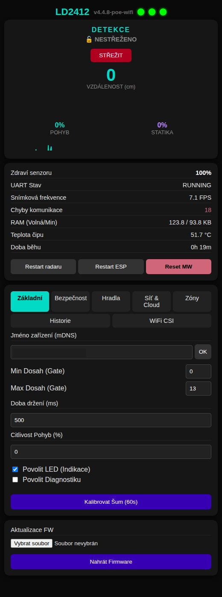
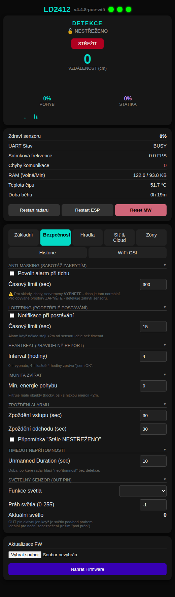
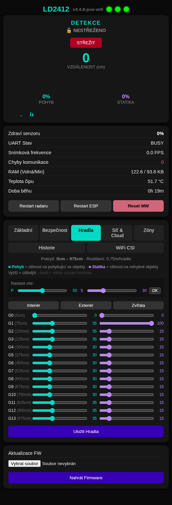
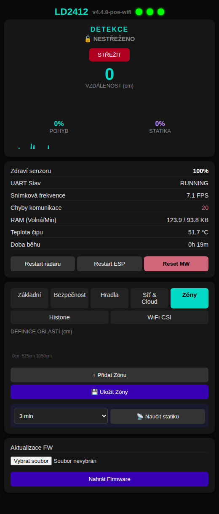
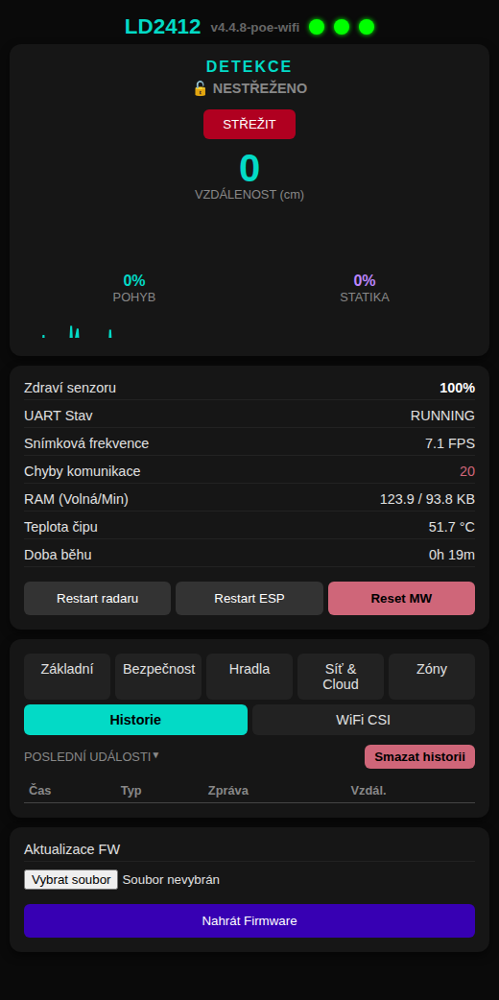
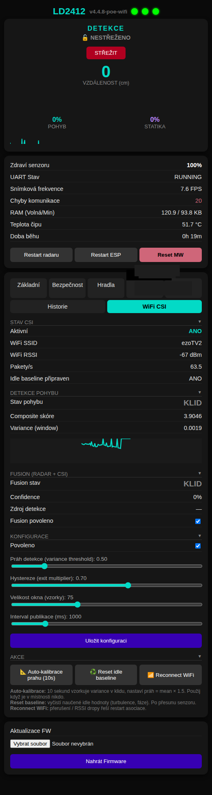

# :shield: POE-2412-WiFi-CSI Security :satellite:

[](https://platformio.org/)
[](https://www.espressif.com/)
[](LICENSE)
[]()

**Dual-sensor intrusion detection system** — ESP32 + HLK-LD2412 24 GHz mmWave radar + **WiFi CSI (Channel State Information) passive motion detection** over **wired Ethernet with Power over Ethernet**. Full alarm state machine, zone management, Home Assistant integration, Telegram bot, and a dark-mode web dashboard. No cloud required.

WiFi CSI detection algorithms based on [ESPectre](https://github.com/francescopace/espectre) by Francesco Pace (GPLv3).

> [!TIP]
> **Latest v4.5.3** — OTA hardening: bound-checked HTTP body uploads (`/api/zones`, `/api/config/import`, `/api/security/event/ack`), `Update.end` now guarded by `Update.hasError()`, static `otaAuthorized` flag restored (fixes 64KB Digest re-auth stall on ETH).
>
> **v4.5.x features** — Fusion-driven alarm (CSI-only triggers alarm, radar FP suppressed), auto-zones from reflector learning, CZ/EN language toggle, event timeline with 24h heatmap, configurable traffic generator (UDP/ICMP/PPS), multi-sensor mesh verification, DMS overflow fix.

---

## Table of Contents

- [In 3 Points](#in-3-points)
- [Why Dual Sensor?](#why-dual-sensor)
- [Who Is This For](#who-is-this-for)
- [What You Need](#what-you-need)
- [Quick Start](#quick-start) (~10 min)
- [How It Works](#how-it-works)
- [Features](#features)
- [System Architecture](#system-architecture)
- [Web Dashboard](#web-dashboard)
- [Telegram Bot](#telegram-bot)
- [API Reference](#api-reference)
- [Differences from WiFi / POE Variants](#differences-from-wifi--poe-variants)
- [Sensor Firmware Quirks](#sensor-firmware-quirks)
- [Known Issues & Limitations](#known-issues--limitations)
- [Troubleshooting](#troubleshooting)
- [Roadmap](#roadmap)
- [FAQ](#faq)
- [Development History](#development-history)
- [Acknowledgments](#acknowledgments)
- [Contributing](#contributing)
- [License](#license)

---

## In 3 Points

1. **It's a security system with dual-sensor fusion, not a smart home gadget.** mmWave radar for active detection, WiFi CSI for passive environmental sensing. Two independent physics principles — harder to defeat than either alone.
2. **It runs over Ethernet.** WiFi is used purely as a CSI sensor (passive signal analysis). Network connectivity, MQTT, OTA — all wired via PoE. No wireless attack surface on the network path.
3. **It's battle-tested.** Forked from the WiFi variant (50+ versions, 13 security bugs found and fixed through formal audit). CSI algorithms ported from ESPectre with production-grade filtering.

---

## Why Dual Sensor?

| | Radar Only | CSI Only | **Radar + CSI (this project)** |
|---|---|---|---|
| **Moving person** | Excellent | Good | Excellent (confirmed by both) |
| **Stationary person** | Weak (static energy decays) | Moderate (breathing detection) | **Strong (CSI compensates radar blind spot)** |
| **Through-wall** | Yes (24 GHz penetrates thin walls) | Yes (WiFi penetrates walls) | Yes |
| **Tamper resistance** | Radar can be shielded | WiFi can be jammed | **Harder — need to defeat both** |
| **False positives** | HVAC, curtains, reflections | AGC fluctuations, traffic | **Lower — cross-validation** |
| **Power** | ~80 mA | ~20 mA (WiFi STA) | ~100 mA total (PoE powered) |

---

## Who Is This For

- **DIY security enthusiasts** who want dual-sensor detection without cloud subscriptions
- **Home Assistant users** looking for a hardwired radar + CSI node with proper alarm state management
- **Vacation home / garage / warehouse owners** who need unattended PoE-powered monitoring
- **CSI researchers** who want a production-ready WiFi CSI implementation on ESP32 with real-world filtering
- **PoE infrastructure users** who already have a PoE switch and want to add security nodes with zero extra wiring

---

## What You Need

### Hardware

| Part | Description | ~Cost |
|------|-------------|-------|
| Prokyber ESP32-STICK-PoE-P | ESP32 + LAN8720A RMII Ethernet, active PoE | ~$15--25 |
| HLK-LD2412 | 24 GHz FMCW mmWave radar (UART) | $4--6 |
| PoE switch or injector | 802.3af/at compliant | $15--30 (or existing) |
| Ethernet cable | Cat5e or better | $1--5 |
| WiFi access point | Any 2.4 GHz AP in range (for CSI capture) | Existing |
| **Total** | | **~$35--65** |

> Any ESP32 board with LAN8720A RMII Ethernet should work with pin adjustments in `platformio.ini`. The Prokyber ESP32-STICK-PoE-P is the tested reference board.

### Software (All Free)

- [PlatformIO](https://platformio.org/) (VS Code extension or CLI)
- [Home Assistant](https://www.home-assistant.io/) (optional, for MQTT integration)
- [Telegram](https://telegram.org/) (optional, for mobile alerts)

### Required Skills

- Basic soldering (4 wires: VCC, GND, TX, RX from ESP32 to radar)
- Editing a config file (MQTT server, WiFi credentials for CSI)
- Flashing an ESP32 via USB (first time only — OTA after that)

---

## Quick Start

**~10 minutes from clone to working alarm.**

```bash
# 1. Clone
git clone https://github.com/PeterkoCZ91/HLK-LD2412-POE-WiFi-CSI-security.git
cd HLK-LD2412-POE-WiFi-CSI-security

# 2. Create your config files (BOTH are required — build fails without them)
cp include/secrets.h.example include/secrets.h
cp include/known_devices.h.example include/known_devices.h

# 3. Edit secrets.h — set your MQTT broker IP and WiFi credentials for CSI
#    (Telegram is optional — leave defaults to skip)

# 4. Wire the radar (see pin table below) and connect ESP32 via USB

# 5. Build and flash
pio run -e esp32_poe_csi --target upload    # With WiFi CSI
# or
pio run -e esp32_poe --target upload        # Radar only (no CSI)
```

### First Boot

After flashing, the device connects via Ethernet (DHCP) and starts radar + CSI capture. Open the web dashboard at the device's IP address (check your router's DHCP table or serial console).

Default credentials: `admin` / `admin` — **change immediately** in the Network & Cloud tab.

---

## How It Works

```
┌─────────────────────────────────────────────────────────┐
│                    ESP32 (PoE Board)                     │
│                                                         │
│  ┌──────────────┐     ┌──────────────┐                  │
│  │  HLK-LD2412  │     │  WiFi STA    │                  │
│  │  24GHz Radar │     │  CSI Sensor  │                  │
│  │  (UART)      │     │  (passive)   │                  │
│  └──────┬───────┘     └──────┬───────┘                  │
│         │                    │                          │
│         ▼                    ▼                          │
│  ┌──────────────┐     ┌──────────────┐                  │
│  │ LD2412Service│     │  CSIService  │                  │
│  │ parse frames │     │ turbulence,  │                  │
│  │ distance,    │     │ phase, ratio │                  │
│  │ energy       │     │ breathing    │                  │
│  └──────┬───────┘     └──────┬───────┘                  │
│         │                    │                          │
│         └────────┬───────────┘                          │
│                  ▼                                      │
│         ┌────────────────┐                              │
│         │SecurityMonitor │                              │
│         │ zones, alarm   │                              │
│         │ state machine  │                              │
│         └───────┬────────┘                              │
│                 │                                       │
│    ┌────────────┼────────────┐                          │
│    ▼            ▼            ▼                          │
│ ┌──────┐  ┌──────────┐  ┌──────────┐                   │
│ │ MQTT │  │ Telegram │  │   Web    │                   │
│ │ + HA │  │   Bot    │  │Dashboard │                   │
│ └──┬───┘  └──────────┘  └──────────┘                   │
│    │                                                    │
│    ▼ Ethernet (PoE) ────────────────────── LAN          │
└─────────────────────────────────────────────────────────┘
```

### Alarm State Machine

```
                    arm (with delay)
    DISARMED ──────────────────────► ARMING
        ▲                              │
        │ disarm                       │ exit delay expires
        │                              ▼
        │◄──────────── disarm ──── ARMED
        │                              │
        │                              │ detection (debounced)
        │                              ▼
        │◄──────────── disarm ──── PENDING
        │                              │
        │                              │ entry delay expires
        │                              ▼
        └◄──────────── disarm ──── TRIGGERED ──► siren/alert
                                       │
                                       │ timeout (auto-rearm
                                       ▼  or auto-disarm)
                                   ARMED/DISARMED
```

**Entry/exit path validation:** Zones can require a specific previous zone (e.g., "hallway" must precede "living room"). Invalid path → immediate trigger (no entry delay).

---

## Features

### Radar (HLK-LD2412)

| Feature | Description |
|---------|-------------|
| Presence detection | Real-time distance, moving energy, static energy |
| Zone management | Up to 8 configurable zones with per-zone alarm behavior |
| Entry/exit path | Zone sequencing — invalid path forces immediate trigger |
| Alarm debounce | Configurable N consecutive frames before state change |
| Static reflector learning | 3-minute auto-calibration with zone suggestion |
| 14-gate sensitivity | Per-gate moving + static energy thresholds |
| Engineering mode | Raw gate-level data for diagnostics |
| Pet immunity | Configurable energy threshold for small objects |

### WiFi CSI

| Feature | Description |
|---------|-------------|
| Spatial turbulence | Std of subcarrier amplitudes (CV normalized, gain-invariant) |
| Phase turbulence | Std of inter-subcarrier phase differences |
| Ratio turbulence | SA-WiSense adjacent amplitude ratios |
| Breathing detection | Bandpass 0.08--0.6 Hz IIR on amplitude sum |
| Composite score | Weighted blend (0.35 turb + 0.25 phase + 0.20 ratio + 0.20 breath) |
| Hampel filter | MAD-based outlier removal (window=7, threshold=5.0) |
| Low-pass filter | 1st-order Butterworth IIR at 11 Hz cutoff |
| Traffic generator | UDP or ICMP ping to gateway, configurable port and PPS (10-500) |
| Breathing hold | Overrides IDLE when breathing/phase suggest stationary person |
| HT20/11n forcing | Consistent 64 subcarriers, guard-band-aware selection |
| STBC handling | Collapsed doubled packets (256→128 bytes) |
| Auto-calibration | Variance sampling → threshold = mean × 1.5 |

### Security & Notifications

| Feature | Description |
|---------|-------------|
| MQTT | Home Assistant auto-discovery, per-topic telemetry |
| Telegram | Arm/disarm, status, alerts, mute, learn, engineering mode |
| Scheduled arm/disarm | Time-based with timezone support |
| Auto-arm | After configurable idle period (no presence) |
| Anti-masking | Detects sensor covering (configurable timeout) |
| Loitering alerts | Sustained close-range presence notification |
| Heartbeat | Periodic "I'm alive" report |
| Event log | LittleFS-backed, paginated API, CSV export |
| Supervision | Heartbeat + mesh peer verification (60s alive, 3min timeout) |
| Mesh verification | Cross-node alarm confirmation via MQTT (5s window) |
| Fusion alarm | CSI-only can trigger alarm; radar FP suppressed by CSI |
| Offline buffer | MQTT messages queued to LittleFS during network outage |

### System

| Feature | Description |
|---------|-------------|
| OTA | Firmware update with automatic rollback on failure |
| Config snapshot | NVS backup before OTA flash |
| Web dashboard | Dark-mode GUI with SSE real-time telemetry, CZ/EN toggle |
| LittleFS assets | Hot-swap web UI without reflash |
| Static IP | Optional fixed IP configuration |
| Chip temperature | MQTT + Telegram alerts on thermal events |
| Heap monitoring | Telegram alerts on low RAM (warn/critical/recover) |
| Factory reset | GPIO 0 long press (5 seconds) |

---

## System Architecture

```
HLK-LD2412-POE-WiFi-CSI-security/
├── include/
│   ├── secrets.h.example          # MQTT, WiFi CSI credentials (copy to secrets.h)
│   ├── known_devices.h.example    # Device MAC→name mapping
│   ├── constants.h                # Timing, deadbands, thresholds
│   ├── ConfigManager.h            # NVS config with static IP + CSI fields
│   ├── web_interface.h            # Embedded HTML/CSS/JS dashboard
│   ├── WebRoutes.h                # REST API route declarations
│   ├── debug.h                    # Conditional debug macros
│   └── services/
│       ├── LD2412Service.h        # Radar UART protocol parser
│       ├── CSIService.h           # WiFi CSI capture + analysis
│       ├── SecurityMonitor.h      # Alarm state machine + zones
│       ├── MQTTService.h          # MQTT with HA auto-discovery
│       ├── MQTTOfflineBuffer.h    # LittleFS-backed offline queue
│       ├── TelegramService.h      # Telegram bot handler
│       ├── NotificationService.h  # Alert routing + cooldowns
│       ├── EventLog.h             # Disk-backed event ring buffer
│       ├── ConfigSnapshot.h       # NVS backup/restore
│       ├── LogService.h           # Structured logging
│       └── BluetoothService.h     # BLE config (optional)
├── src/                           # Implementation files
├── lib/LD2412_Extended/           # Radar protocol library
├── platformio.ini                 # Build environments
├── partitions_16mb.csv            # 16 MB flash partition table
├── tools/upload_www.sh            # LittleFS web asset uploader
├── LICENSE                        # GPL-3.0
└── CHANGELOG.md                   # Version history
```

---

## Web Dashboard

The embedded web dashboard provides real-time telemetry, alarm control, zone management, gate sensitivity tuning, and WiFi CSI configuration — all in a dark-mode responsive UI.

**Tabs:** Basic | Security | Gates | Network & Cloud | Zones | Events | WiFi CSI

| | |
|---|---|
|  |  |
|  |  |
|  |  |

The CSI tab shows live turbulence, composite score, packet rate, traffic generator controls (UDP/ICMP/PPS), and provides auto-calibration and baseline reset. The Events tab features a 24h activity heatmap with type filtering and CSV export. CZ/EN language toggle in header.

---

## Telegram Bot

| Command | Description |
|---------|-------------|
| `/status` | Detailed status (FW, UART, gates, alarm state) |
| `/arm` | Arm alarm (with exit delay) |
| `/arm_now` | Immediate arm (no delay) |
| `/disarm` | Disarm alarm |
| `/learn` | Start static reflector learning (3 min) |
| `/light` | Read light sensor level |
| `/mute` | Mute notifications for 10 min |
| `/unmute` | Cancel mute |
| `/eng_on` | Enable engineering mode |
| `/eng_off` | Disable engineering mode |
| `/restart` | Restart device |
| `/help` | Show all commands |

---

## API Reference

All endpoints require Digest auth except where noted.

### Status & Telemetry

| Method | Endpoint | Description |
|--------|----------|-------------|
| GET | `/api/health` | Uptime, Ethernet info, MQTT, heap, CSI status, reset history |
| GET | `/api/telemetry` | Radar state, distance, energy, UART stats |
| GET | `/api/version` | Firmware version string (no auth — used by GUI before login) |
| GET/DELETE | `/api/debug` | Last 4 KB of DBG() ring buffer; DELETE clears it |

### Alarm & Security

| Method | Endpoint | Description |
|--------|----------|-------------|
| GET | `/api/alarm/status` | Alarm state, current zone, debounce, last event |
| POST | `/api/alarm/arm` | Arm system (`?immediate=1` for no delay) |
| POST | `/api/alarm/disarm` | Disarm system |
| GET/POST | `/api/alarm/config` | Entry/exit delay, debounce frames, disarm reminder |
| GET/POST | `/api/security/config` | Anti-masking, loitering, heartbeat, pet immunity |
| POST | `/api/security/event/ack` | Acknowledge a security event |
| GET/POST | `/api/schedule` | Scheduled arm/disarm times |
| GET/POST | `/api/timezone` | Timezone and DST offset |

### Events & Logs

| Method | Endpoint | Description |
|--------|----------|-------------|
| GET | `/api/events` | Paginated event log (`?offset=&limit=&type=`) |
| GET | `/api/events/csv` | Download events as CSV |
| POST | `/api/events/clear` | Clear event history |
| GET/DELETE | `/api/logs` | Structured log query / clear |

### Radar

| Method | Endpoint | Description |
|--------|----------|-------------|
| POST | `/api/radar/restart` | Restart radar (UART reset) |
| POST | `/api/radar/factory_reset` | Restore radar to factory defaults |
| POST | `/api/radar/calibrate` | Start radar calibration |
| POST | `/api/engineering` | Toggle engineering mode (raw gate data) |
| POST | `/api/radar/gate` | Set per-gate threshold (moving/static) |
| POST | `/api/radar/gates` | Bulk gate-threshold update (JSON body) |
| GET | `/api/radar/resolution` | Query resolution mode (0.75m / 0.50m / 0.20m) |
| GET/POST | `/api/radar/light` | Light function and threshold |
| GET/POST | `/api/radar/timeout` | Presence hold time |
| GET/POST | `/api/radar/learn-static` | Start/check static reflector learning |
| POST | `/api/radar/apply-learn` | Auto-create ignore zone from reflector learn results |
| GET/POST | `/api/zones` | Zone definitions (JSON array) |

### WiFi CSI (CSI build only)

| Method | Endpoint | Description |
|--------|----------|-------------|
| GET/POST | `/api/csi` | CSI metrics, config, diagnostics |
| POST | `/api/csi/calibrate` | Auto-calibrate CSI threshold |
| POST | `/api/csi/reset_baseline` | Reset CSI idle baselines |
| POST | `/api/csi/reconnect` | Force WiFi reconnect for CSI |

### Configuration & OTA

| Method | Endpoint | Description |
|--------|----------|-------------|
| GET/POST | `/api/config` | Full system configuration |
| GET/POST | `/api/mqtt/config` | MQTT server/port/user/pass/id |
| GET/POST | `/api/telegram/config` | Telegram bot token and chat id |
| POST | `/api/telegram/test` | Send a test Telegram message |
| POST | `/api/auth/config` | Change web admin user/password |
| GET/POST | `/api/network/config` | Static IP and DNS |
| GET | `/api/config/export` | Download JSON snapshot of all settings |
| POST | `/api/config/import` | Upload JSON to restore settings (reboots) |
| GET | `/api/config/snapshots` | List NVS config snapshots |
| POST | `/api/config/restore` | Restore a named snapshot |
| POST | `/api/preset` | Apply a named preset |
| POST | `/api/update` | OTA firmware upload (multipart) |
| POST | `/api/restart` | Soft reboot |
| POST | `/api/bluetooth/start` | Enable BLE config mode |
| DELETE/POST | `/api/www` | Manage LittleFS web assets (delete / upload) |

---

## Differences from WiFi / POE Variants

| Feature | [WiFi](https://github.com/PeterkoCZ91/HLK-LD2412-security) | [POE](https://github.com/PeterkoCZ91/POE-2412-security) | **This (POE+CSI)** |
|---------|:---:|:---:|:---:|
| Network | WiFi | Ethernet (PoE) | Ethernet (PoE) |
| WiFi CSI | -- | -- | Yes |
| Traffic generator | -- | -- | DNS 100 pps |
| Breathing detection | -- | -- | Yes |
| Chip temp monitoring | -- | Yes | Yes |
| Heap Telegram alerts | -- | Yes | Yes |
| Config snapshot | -- | Yes | Yes |
| LittleFS web assets | -- | Yes | Yes |
| Static IP config | -- | Yes | Yes |
| MQTT offline buffer | Yes | Yes (rewritten) | Yes (rewritten) |
| OTA rollback | -- | Yes | Yes |

---

## Sensor Firmware Quirks

The HLK-LD2412 sensor has several known firmware issues:

- **Engineering mode broken on V1.24 and V1.26** — ACKs the command but doesn't switch. Use Bluetooth app (HLKRadarTool) for mode changes.
- **`setBaudRate` on V1.26** — ACKs but doesn't actually change baud rate.
- **`setResolution` on V1.26** — Breaks radar communication.
- **`getResolution` on V1.26** — Returns -1.
- **V1.36 is the only version where engineering mode works** (confirmed by Tasmota community) — but not available through standard channels.

---

## Known Issues & Limitations

- WiFi CSI requires a 2.4 GHz AP in range — 5 GHz only networks won't work
- ESP32 classic doesn't support AGC lock — CV normalization is used as fallback (less sensitive than locked gain)
- CSI packet rate depends on WiFi channel conditions — DNS traffic generator compensates but may not reach full 100 pps in congested environments
- STBC doubled packets from some APs are handled but may introduce slight amplitude averaging

---

## Troubleshooting

| Symptom | Cause | Fix |
|---------|-------|-----|
| No CSI packets (pps = 0) | WiFi not connected to AP | Check `CSI_WIFI_SSID`/`CSI_WIFI_PASS` in secrets.h |
| CSI false positives | AGC fluctuations | Run auto-calibration in quiet room |
| Build fails | Missing config files | `cp include/secrets.h.example include/secrets.h` |
| OTA fails | Unstable network | Restart device, retry. Or flash via USB |
| ETH link not up | Wrong PHY config | Check `ETH_PHY_ADDR` in platformio.ini |
| Radar disconnected | Wrong UART pins | Check GPIO32 (RX) / GPIO33 (TX) wiring |
| Web dashboard 401 | Wrong credentials | Default: admin/admin. Factory reset via GPIO 0 |

---

## Roadmap

- [x] i18n (CZ/EN toggle in web GUI) — **v4.5.1**
- [x] Fusion-driven alarm (CSI-only triggers, radar FP suppression) — **v4.5.0**
- [x] Auto-zones from reflector learning — **v4.5.0**
- [x] Event timeline with 24h heatmap — **v4.5.0**
- [x] Multi-sensor mesh verification — **v4.5.0**
- [ ] NBVI subcarrier auto-selection (per-environment optimal band)
- [ ] ML neural network detector (MLP trained on local CSI data)
- [ ] Adaptive threshold (P95-based instead of mean × 1.5)
- [ ] Auto-recalibration after quiet period
- [ ] Stuck-in-motion detection (auto threshold raise after 24h)

---

## FAQ

**Q: Do I need two WiFi networks?**
A: No. WiFi CSI uses your existing 2.4 GHz AP. The ESP32 connects to it purely for CSI capture — it doesn't use WiFi for internet. All network traffic goes through Ethernet.

**Q: Can I run without WiFi CSI?**
A: Yes. Build with `esp32_poe` environment instead of `esp32_poe_csi`. Radar detection works independently.

**Q: Does WiFi CSI work through walls?**
A: Yes, WiFi signals penetrate thin walls. CSI sensitivity decreases with distance/obstacles but can detect motion in adjacent rooms.

**Q: Why GPL-3.0 and not MIT like the other variants?**
A: WiFi CSI algorithms are based on ESPectre (GPLv3). GPL requires derivative works to maintain the same license. The radar-only variant remains MIT.

**Q: What's the detection range?**
A: Radar: up to 6m (configurable). CSI: depends on AP distance and environment — typically 3--8m with clear line of sight.

---

## Development History

| Version | Highlights |
|---------|-----------|
| v3.9.5-poe-wifi | Initial fork with WiFi CSI basic implementation |
| v4.0.x-poe-wifi | Ethernet hardening, OTA rollback, chip temp monitoring |
| v4.1.0-poe-wifi | Static IP, scheduled arm/disarm, CSV export |
| v4.1.1-poe-wifi | ESPHome 2026.3 audit hardening |
| v4.1.3-poe-wifi | ESP32Async HTTP library swap for stability |
| v4.1.4-poe-wifi | CSI runtime config, GUI tab, diagnostics |
| v4.2.0-poe-wifi | ESPectre port: Hampel, low-pass, CV normalization, DNS traffic gen, breathing hold, HT20/11n, entry/exit path validation, event timeline, 50ms radar tick |
| v4.5.0-poe-wifi | Fusion alarm (CSI-only trigger, radar FP suppression), auto-zones from learning, event timeline UI with 24h heatmap, OTA delay fix, traffic gen tuning (port/ICMP/PPS), mesh verification, supervision heartbeat |
| v4.5.1-poe-wifi | CZ/EN language toggle (i18n), DMS millis() overflow fix (49-day crash), GUI traffic generator controls |
| v4.5.3-poe-wifi | OTA hardening: static auth flag (fixes 64KB Digest re-auth stall), `Update.end` guarded by `hasError()`, `Update.abort()` on error path; bound-checked HTTP body uploads |

---

## Related Projects

- **[multi-sensor-fusion](https://github.com/PeterkoCZ91/multi-sensor-fusion)** — Python service that fuses this node's MQTT output with additional LD2412 / LD2450 nodes, standalone WiFi CSI (ESPectre), and Home Assistant sensors into a single weighted-average presence confidence per room. Ships with data-driven weight tuning tools.
- **[HLK-LD2412-security](https://github.com/PeterkoCZ91/HLK-LD2412-security)** — The WiFi variant of the LD2412 node.
- **[HLK-LD2412-POE-security](https://github.com/PeterkoCZ91/HLK-LD2412-POE-security)** — The PoE variant without CSI.
- **[HLK-LD2450-security](https://github.com/PeterkoCZ91/HLK-LD2450-security)** — Sister project using the 2D LD2450 radar.
- **[espectre](https://github.com/francescopace/espectre)** — The upstream standalone WiFi CSI motion detection project this firmware's CSI pipeline is based on.

---

## Acknowledgments

- **[Francesco Pace](https://github.com/francescopace)** — [ESPectre](https://github.com/francescopace/espectre) WiFi CSI motion detection (GPLv3). CSI algorithms, filtering pipeline, and traffic generation concepts ported to this project.
- **[ESP32Async](https://github.com/ESP32Async)** — Community fork of AsyncTCP and ESPAsyncWebServer.
- **[HLK-LD2412](https://www.hlktech.net/)** — Hi-Link 24 GHz FMCW mmWave radar module.
- **[Tasmota/Staars](https://github.com/Staars)** — LD2412 community protocol research.

---

## Contributing

Contributions are welcome! Please:

1. Fork the repository
2. Create a feature branch (`git checkout -b feature/my-feature`)
3. Commit your changes
4. Push to the branch (`git push origin feature/my-feature`)
5. Open a Pull Request

For bug reports, please include: firmware version, serial log output, and steps to reproduce.

---

## License

This project is licensed under the **GNU General Public License v3.0** — see [LICENSE](LICENSE) for details.

WiFi CSI detection algorithms are based on [ESPectre](https://github.com/francescopace/espectre) by Francesco Pace, licensed under GPLv3.

The radar-only variants ([HLK-LD2412-security](https://github.com/PeterkoCZ91/HLK-LD2412-security), [POE-2412-security](https://github.com/PeterkoCZ91/POE-2412-security)) remain MIT-licensed.
